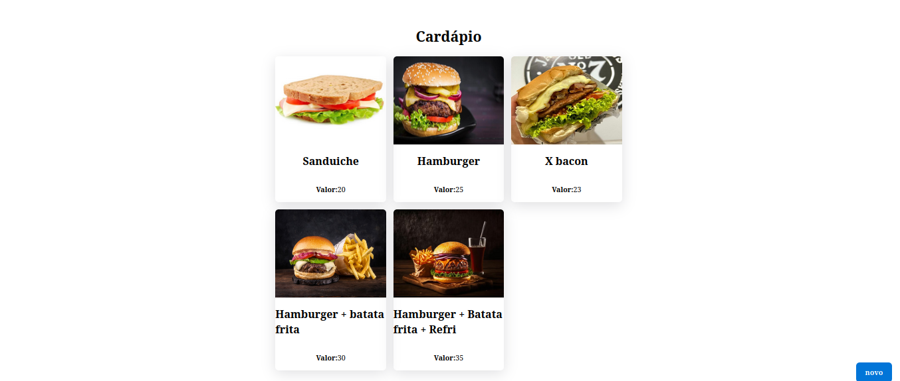

# Cardápio Digital - Aplicação Full Stack

Este projeto é um simples simples protótipo de um Cardápio Digital desenvolvido pela Fernanda Kipper [tutorial no YouTube](https://www.youtube.com/@kipperdev). A aplicação foi desenvolvida usando **React, Typescript e React Query**.

 

## 💻 Requisitos

Antes de iniciar, você deve ter o Node.js e o NPM instalados em sua máquina.

Para instalar as dependências, execute o seguinte comando:

```bash
npm install
```

Por fim, para executar o projeto basta rodar o seguinte:

```bash
npm run dev
```

## 🔧 Compilação

Para compilar a aplicação para produção, execute o seguinte comando:

```bash
npm run build
```
Isso irá gerar uma versão otimizada da aplicação na pasta `dist`.

## 🫂 Backend
- Linguagem utilizada Java 
- Lombok
- Postgres
- JPA
- Dev Tolls
 

## 📝 Licença

Este projeto está licenciado sob a licença MIT. Consulte o arquivo `LICENSE` para obter mais informações.
